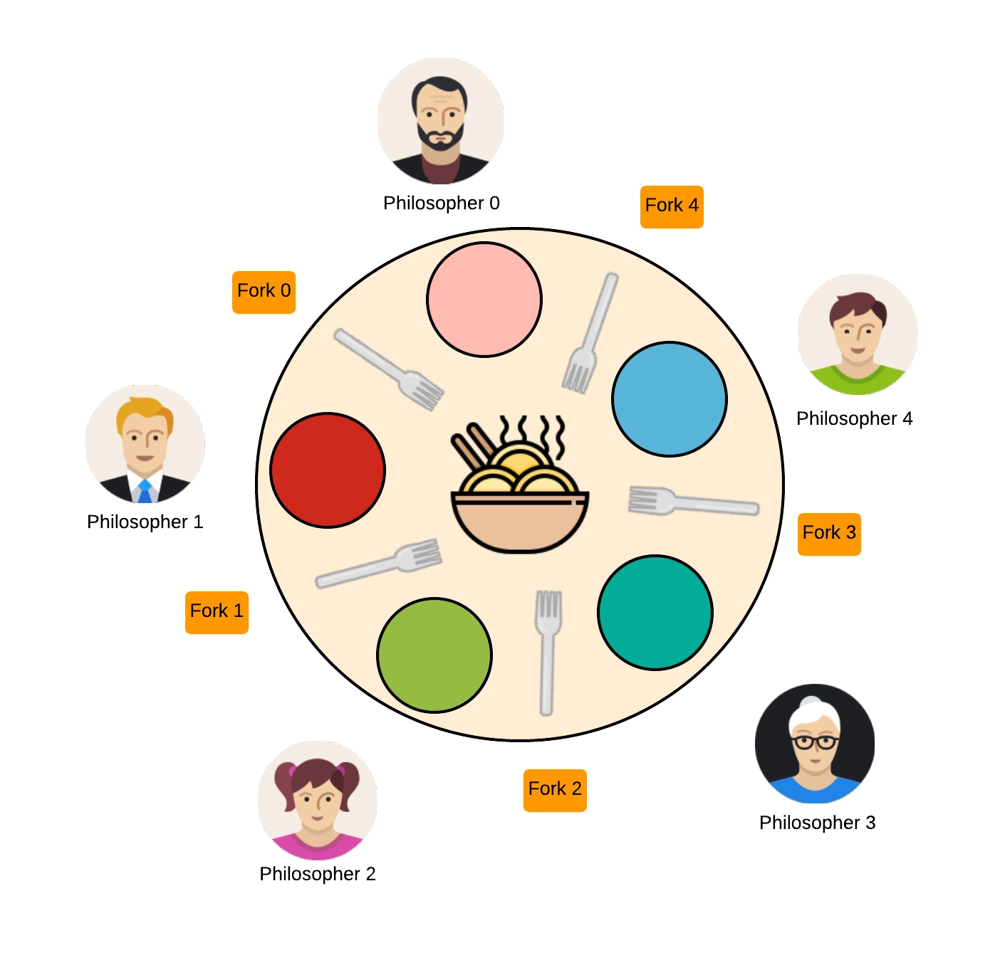

*This project has been created as part of the 42 curriculum by cmauley.*

# Philosophers

<p align="center">
  
  
  
  
</p>

<p align="center">
  
</p>

<p align="center">
  Source image :
  <a href="https://www.naukri.com/code360/library/dining-philosopher-problem-using-semaphores-2383">
    Code360 - Dining Philosopher Problem Using Semaphores
  </a>
</p>

| État du projet | Détails |
|---|---|
| Partie réalisée | Mandatory |
| Fuites mémoire | Testé avec Valgrind |
| Data races | Testé avec Helgrind |

## Sommaire

- [Description](#description)
- [Fonctionnement](#fonctionnement)
- [Comprendre les threads](#comprendre-les-threads)
- [Comprendre les mutex](#comprendre-les-mutex)
- [Comprendre les data races](#comprendre-les-data-races)
- [Comprendre le monitoring](#comprendre-le-monitoring)
- [Erreurs fréquentes et points d'attention](#erreurs-fréquentes-et-points-dattention)
- [Instructions](#instructions)
- [Arguments](#arguments)
- [Exemples](#exemples)
- [Tests utiles](#tests-utiles)
- [Ressources](#ressources)
- [Utilisation de l'IA](#utilisation-de-lia)

## Description

Philosophers est un projet de l'école 42 permettant de découvrir les threads,
les mutex et les problèmes liés à la programmation concurrente.

Le programme simule plusieurs philosophes assis autour d'une table. Chaque
philosophe alterne entre trois actions : manger, dormir et penser. Pour manger,
un philosophe doit obtenir les deux fourchettes placées à ses côtés.

L'objectif principal est d'éviter les blocages, les data races et la famine,
tout en détectant rapidement la mort éventuelle d'un philosophe.

## Fonctionnement

- Chaque philosophe est représenté par un thread.
- Chaque fourchette est protégée par un mutex.
- Un mutex protège les données partagées.
- Un mutex empêche le mélange des messages affichés.
- Les philosophes pairs et impairs ne prennent pas leurs fourchettes dans le
  même ordre afin d'éviter un deadlock.
- Un monitor vérifie la mort des philosophes et le quota optionnel de repas.
- La simulation s'arrête lorsqu'un philosophe meurt ou lorsque tous les
  philosophes ont atteint leur quota.

## Comprendre les threads

### Qu'est-ce qu'un thread ?

Un programme classique exécute généralement ses instructions les unes après les
autres. Un **thread** est un chemin d'exécution à l'intérieur du programme.
Plusieurs threads permettent donc d'effectuer plusieurs tâches en même temps.

Dans ce projet, chaque philosophe doit vivre indépendamment des autres :

```text
Thread du philosophe 1 : manger -> dormir -> penser -> ...
Thread du philosophe 2 : manger -> dormir -> penser -> ...
Thread du philosophe 3 : manger -> dormir -> penser -> ...
```

Tous ces threads appartiennent au même programme et partagent sa mémoire. Ils
peuvent donc accéder à la même table, aux mêmes fourchettes et au même état de
simulation.

> **Image simple :** le programme est une cuisine et les threads sont plusieurs
> cuisiniers travaillant en même temps dans cette cuisine. Ils partagent le
> matériel, mais chacun suit sa propre suite d'actions.

### Comment sont-ils créés ici ?

La fonction [`create_threads`](srcs/simulation.c#L34) appelle
`pthread_create` une fois pour chaque philosophe :

```c
pthread_create(&table->philos[i].thread_id, NULL,
	philo_routine, &table->philos[i]);
```

Les quatre arguments importants sont :

| Argument | Rôle |
|---|---|
| `&thread_id` | reçoit l'identifiant du nouveau thread |
| `NULL` | utilise les options par défaut |
| `philo_routine` | fonction exécutée par le thread |
| `&table->philos[i]` | philosophe transmis à cette fonction |

Chaque thread démarre donc dans
[`philo_routine`](srcs/routine.c#L41). Cette routine récupère son philosophe,
attend éventuellement un peu, puis répète :

```text
prendre les fourchettes -> manger -> déposer les fourchettes
-> dormir -> penser
```

### Pourquoi utiliser `pthread_join` ?

Le thread principal lance les philosophes, mais il doit aussi attendre leur fin
avant de détruire les mutex et libérer la mémoire.

[`join_threads`](srcs/simulation.c#L54) appelle `pthread_join` sur chaque thread
créé. Sans cette attente, `main` pourrait nettoyer la table pendant que des
philosophes l'utilisent encore.

```text
création des threads
        |
        v
     monitor
        |
        v
arrêt de la simulation
        |
        v
 pthread_join de tous les threads
        |
        v
 nettoyage de la mémoire
```

## Comprendre les mutex

### Qu'est-ce qu'un mutex ?

Un **mutex** est un verrou protégeant une ressource partagée. Un seul thread
peut posséder ce verrou à la fois.

```text
Thread A verrouille le mutex
Thread B veut le même mutex et doit attendre
Thread A déverrouille le mutex
Thread B peut enfin continuer
```

Dans le projet, les appels sont regroupés dans
[`mutex.c`](srcs/utils/mutex.c) afin de vérifier facilement les erreurs de
`pthread_mutex_init`, `pthread_mutex_lock`, `pthread_mutex_unlock` et
`pthread_mutex_destroy`.

### Les mutex utilisés dans ce projet

| Mutex | Ce qu'il protège | Pourquoi |
|---|---|---|
| Mutex de chaque fourchette | une fourchette précise | empêche deux voisins de prendre la même fourchette |
| `data_mutex` | `last_meal_time`, `meals_counter`, `end_simulation` | empêche les lectures et écritures concurrentes |
| `print_mutex` | l'affichage des statuts | empêche deux messages de se mélanger |

Les mutex des fourchettes sont initialisés dans
[`init_forks`](srcs/init.c#L32). Lorsqu'un philosophe mange,
[`take_forks`](srcs/actions.c#L88) verrouille ses fourchettes et
[`drop_forks`](srcs/actions.c#L18) les déverrouille ensuite.

### Pourquoi changer l'ordre de prise des fourchettes ?

Si tous les philosophes prennent d'abord leur fourchette gauche, chacun peut se
retrouver avec une fourchette en attendant éternellement la seconde. Cela
s'appelle un **deadlock**.

```text
Philo 1 possède gauche et attend droite
Philo 2 possède gauche et attend droite
Philo 3 possède gauche et attend droite
=> personne ne peut avancer
```

[`choose_forks`](srcs/actions.c#L71) évite cette situation en donnant un ordre
différent aux philosophes pairs et impairs :

- les philosophes pairs prennent d'abord la fourchette droite ;
- les philosophes impairs prennent d'abord la fourchette gauche.

Le léger décalage des philosophes pairs dans
[`philo_routine`](srcs/routine.c#L52) réduit également les conflits au
démarrage.

> **Règle essentielle :** chaque `lock` réussi doit avoir un `unlock`
> correspondant, y compris lorsqu'une erreur ou un arrêt survient.

## Comprendre les data races

### Qu'est-ce qu'une data race ?

Une **data race** arrive lorsque plusieurs threads accèdent en même temps à une
même donnée, qu'au moins l'un d'eux la modifie, et qu'aucun mutex ne protège ces
accès.

Exemple dangereux :

```c
philo->meals_counter++;
```

Pendant cette modification, le monitor pourrait lire `meals_counter`. Le
résultat devient imprévisible : le monitor peut lire une ancienne valeur, une
valeur incohérente, ou provoquer un comportement indéfini.

### Comment sont-elles évitées ici ?

Les données partagées qui peuvent changer pendant la simulation sont toujours
lues et modifiées sous `data_mutex`.

Dans [`eat`](srcs/actions.c#L33), le philosophe protège la mise à jour de son
dernier repas :

```c
safe_mutex_lock(&philo->table->data_mutex);
philo->last_meal_time = get_time();
safe_mutex_unlock(&philo->table->data_mutex);
```

Dans [`is_dead`](srcs/monitor.c#L18), le monitor utilise le **même mutex** avant
de lire cette valeur. Protéger uniquement l'écriture ou uniquement la lecture
ne suffit pas : tous les accès concernés doivent suivre la même règle.

Le même principe est utilisé pour :

- `meals_counter`, modifié dans `eat` et lu par le monitor ;
- `end_simulation`, modifié lors de l'arrêt et lu par tous les threads ;
- l'affichage, protégé par `print_mutex` dans
  [`print_status`](srcs/routine.c#L18) et
  [`print_death`](srcs/utils/utils.c#L27).

### Comment vérifier les data races ?

Helgrind observe les accès mémoire effectués par les threads :

```bash
valgrind --tool=helgrind ./philo 5 800 200 200 3
```

Le résultat recherché est :

```text
ERROR SUMMARY: 0 errors
```

Helgrind ralentit fortement le programme. Les timings observés sous Helgrind ne
doivent donc pas servir à juger la précision de la détection de mort.

## Comprendre le monitoring

Le **monitor** est exécuté par le thread principal pendant que les philosophes
exécutent leurs routines. Son rôle est d'observer la simulation sans agir comme
un philosophe.

La fonction [`monitor`](srcs/monitor.c#L85) répète deux contrôles :

1. Vérifier si tous les philosophes ont atteint le quota optionnel.
2. Vérifier si un philosophe a dépassé `time_to_die`.

```text
                 +-------------------------+
                 | tous les quotas atteints ? |
                 +------------+------------+
                              |
                    oui ------+------ non
                     |                 |
              arrêter la simulation    v
                                vérifier chaque mort
                                        |
                          mort ----------+---------- aucune mort
                           |                         |
                    afficher "died"            courte pause
                           |                         |
                    arrêter la simulation <---------+
```

### Détection d'une mort

[`is_dead`](srcs/monitor.c#L18) compare le temps actuel au début du dernier
repas :

```text
temps actuel - dernier repas >= time_to_die
```

La valeur `last_meal_time` est mise à jour lorsqu'un philosophe **commence** à
manger, conformément au sujet.

Lorsqu'une mort est détectée,
[`print_death`](srcs/utils/utils.c#L27) verrouille d'abord `print_mutex`, place
`end_simulation` à `1`, puis affiche la mort. Comme `print_status` vérifie ce
même état sous le même verrou d'affichage, aucun statut normal ne peut être
affiché après `died`.

### Arrêt par quota

[`all_full`](srcs/monitor.c#L51) vérifie que chaque `meals_counter` a atteint le
quota demandé. La simulation ne s'arrête pas dès qu'un seul philosophe atteint
son quota : **tous** doivent l'avoir atteint.

Le compteur est augmenté après la fin complète d'un repas dans
[`eat`](srcs/actions.c#L33).

## Erreurs fréquentes et points d'attention

### Oublier de déverrouiller un mutex

Un `return` placé entre un `lock` et son `unlock` peut laisser le mutex verrouillé
pour toujours. Les autres threads restent alors bloqués.

À chaque branche d'erreur, il faut se demander :

```text
Quels mutex ce thread possède-t-il actuellement ?
Dois-je les libérer avant de retourner ?
```

### Afficher après une mort

Lire `end_simulation`, libérer le mutex, puis afficher sans protection commune
laisse le temps au monitor d'annoncer une mort entre les deux opérations.

Dans ce projet, `print_status` conserve `print_mutex` pendant la vérification et
l'affichage. `print_death` utilise le même mutex.

### Confondre `pthread_join` avec l'arrêt des threads

`pthread_join` ne demande pas à un thread de terminer. Il attend seulement sa
fin. Il faut d'abord modifier `end_simulation`, laisser les routines sortir,
puis effectuer les `join`.

### Gérer un échec partiel de `pthread_create`

La création du quatrième thread peut échouer alors que les trois premiers
tournent déjà. Il faut donc :

1. compter les threads réellement créés ;
2. demander l'arrêt de la simulation ;
3. attendre uniquement ces threads avec `pthread_join` ;
4. afficher l'erreur puis nettoyer.

Cette logique se trouve dans
[`create_threads`](srcs/simulation.c#L34) et
[`dinner_start`](srcs/simulation.c#L76).

### Utiliser directement `usleep` pour les longues actions

Un long `usleep` empêche un philosophe de remarquer rapidement l'arrêt de la
simulation. [`safe_sleep`](srcs/utils/time.c#L18) effectue donc de petites
pauses et vérifie régulièrement `end_simulation`.

### Le cas d'un seul philosophe

Avec un seul philosophe, il existe une seule fourchette. Il la prend, mais ne
peut jamais obtenir une deuxième fourchette pour manger. Il meurt donc après
`time_to_die`. Ce comportement est géré dans
[`philo_routine`](srcs/routine.c#L47) et
[`take_forks`](srcs/actions.c#L98).

### Nettoyer après une initialisation incomplète

Une allocation ou l'initialisation d'un mutex peut échouer au milieu de
`data_init`. Les compteurs d'initialisation permettent à
[`clean`](srcs/utils/utils.c#L61) de détruire uniquement les mutex réellement
initialisés.

### Tester plusieurs fois

Les problèmes de threads sont souvent intermittents : un programme peut
fonctionner neuf fois puis échouer à la dixième selon l'ordre choisi par le
système. Les scénarios importants doivent donc être répétés.

## Instructions

### Compilation

```bash
make
```

Le Makefile fournit également les règles suivantes :

```bash
make clean
make fclean
make re
```

### Exécution

```bash
./philo number_of_philosophers time_to_die time_to_eat time_to_sleep \
[number_of_times_each_philosopher_must_eat]
```

Toutes les durées sont exprimées en millisecondes.

## Arguments

- `number_of_philosophers` : nombre de philosophes et de fourchettes.
- `time_to_die` : durée maximale sans commencer un repas avant de mourir.
- `time_to_eat` : durée pendant laquelle un philosophe mange.
- `time_to_sleep` : durée pendant laquelle un philosophe dort.
- `number_of_times_each_philosopher_must_eat` : quota optionnel de repas.

Les arguments doivent être des entiers strictement positifs.

## Exemples

Simulation sans quota :

```bash
./philo 5 800 200 200
```

Simulation s'arrêtant lorsque chaque philosophe a mangé au moins trois fois :

```bash
./philo 5 800 200 200 3
```

Cas d'un philosophe seul : il prend son unique fourchette, ne peut pas manger,
puis meurt après `time_to_die`.

```bash
./philo 1 200 100 100
```

Les messages suivent toujours l'un des formats imposés :

```text
timestamp philosopher_id has taken a fork
timestamp philosopher_id is eating
timestamp philosopher_id is sleeping
timestamp philosopher_id is thinking
timestamp philosopher_id died
```

## Tests utiles

Vérifier les fuites mémoire :

```bash
valgrind --leak-check=full ./philo 5 800 200 200 3
```

Vérifier les data races :

```bash
valgrind --tool=helgrind ./philo 5 800 200 200 3
```

Tester une mort et vérifier qu'aucun message ne suit `died` :

```bash
./philo 4 310 200 100
```

Tester une simulation avec beaucoup de threads :

```bash
./philo 200 800 200 200 2
```

## Ressources

- [POSIX Threads Programming](https://hpc-tutorials.llnl.gov/posix/)
- [POSIX Threads in OS](https://www.geeksforgeeks.org/operating-systems/posix-threads-in-os/)
- [Documentation pthreads](https://man7.org/linux/man-pages/man7/pthreads.7.html)
- [Documentation pthread_mutex_lock](https://man7.org/linux/man-pages/man3/pthread_mutex_lock.3p.html)
- [Documentation pthread_create](https://man7.org/linux/man-pages/man3/pthread_create.3.html)
- [The Dining Philosophers](https://medium.com/@jalal92/the-dining-philosophers-7157cc05315)
- [Superbe vidéo](https://www.youtube.com/watch?v=mvZKu0DfFLQ)
- Sujet officiel Philosophers fourni par l'école 42.


## Utilisation de l'IA

L'IA a été utilisée comme outil pédagogique pendant le
développement. Elle a notamment servi à :

- expliquer progressivement les threads, mutex, deadlocks et data races ;
- proposer des scénarios de test et analyser leurs résultats ;
- vérifier les cas limites, les fuites mémoire et les data races ;
- aider à organiser les commentaires et la documentation, notamment à traduire
  ce README en anglais.

Le code a été construit à la main et étudié étape par étape afin que chaque
choix reste compris et puisse être expliqué pendant l'évaluation.
